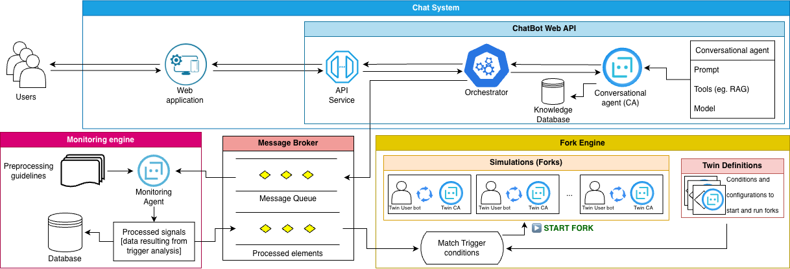

# Digital Twin Chat Framework (dt-chat)

> An academic research-driven framework to execute, monitor, simulate, and evaluate conversational LLM agents using Digital Twin architectures and Process Mining techniques.

Digital Twin Chat (dt-chat) is designed to evaluate Large Language Models inside a simulated customer-service banking domain. The framework generates dialogues between simulated users (`UserBots`) and conversational assistants, maps unstructured messages into structured business events called **touchpoints**, and dynamically forks active conversations into parallel "what-if" **Digital Twin** simulations to compare different model configurations under identical starting conditions.

## Architecture Overview

The system operates as a set of decoupled, concurrent processes communicating in real-time over a Redis pub/sub broker.



1. **Dialogue Generation**: A swarm of `UserBots` interacts concurrently with the `Bancobot` assistant over HTTP.
2. **Real-time Streaming**: `Bancobot` publishes all messages to a Redis queue.
3. **Event Classification**: The `Classifier` processes the raw messages and maps them to structured business **touchpoints**, publishing these touchpoint events to a secondary Redis stream.
4. **Digital Twin Forking**: The `Fork Engine` monitors the touchpoint stream. When an event trigger (e.g. human escalation) occurs, it freezes the dialogue state, forks the history, and spins up alternative digital twin agents in parallel simulation loops.
5. **Analytical Export**: The `Exporter` aggregates the logs into standard CSV event logs ready to be evaluated inside process mining software (e.g., Celonis, Disco, PM4Py).

## Directory Structure

```sh
dt-chat/
├── apps/               # Executable application packages
│   ├── bancobot/       # Financial chatbot API (RAG assistant)
│   ├── classifier/     # Message stream Touchpoint classifier
│   ├── exporter/       # Process mining CSV event log exporter
│   └── fork_engine/    # Simulation and digital twin reactive engine
├── libs/               # Core utility libraries
│   ├── chatbot/        # LangChain wrapper & LLM configurations
│   ├── pubsub/         # Redis-based async Publisher/Subscriber interface
│   ├── timesim/        # Simulation timing configuration & modeling
│   └── userbot/        # Simulated client (persona-based UserBot)
├── scripts/            # Standalone automation & post-processing scripts
├── data/               # Configs, personas, touchpoint lists, and RAG text documents
├── docs/               # Detailed documentation files
└── assets/             # Architectural model assets & diagrams
```

## Core Components Reference

### 1. Applications (`apps/`)

- **[Bancobot](apps/bancobot/README.md)**: A FastAPI-based credit card customer assistant utilizing Retrieval-Augmented Generation (RAG).
  - _Detailed Documentation: [docs/bancobot.md](docs/bancobot.md)_
- **[Classifier](apps/classifier/README.md)**: A stream worker mapping raw human/AI messages to structured touchpoints via LLM instruction.
  - _Detailed Documentation: [docs/classifier.md](docs/classifier.md)_
- **[Fork Engine](apps/fork_engine/README.md)**: A reactive simulator that duplicates live contexts at trigger points to evaluate multiple twin variants.
  - _Detailed Documentation: [docs/fork_engine.md](docs/fork_engine.md)_
- **[Exporter](apps/exporter/README.md)**: Compiled utility exporting touchpoint logs into process mining schemas.
  - _Detailed Documentation: [docs/exporter.md](docs/exporter.md)_

### 2. Supporting Libraries (`libs/`)

- **[Chatbot](libs/chatbot/README.md)**: Standardizes conversational model creations and tool bindings.
  - _Detailed Documentation: [docs/chatbot.md](docs/chatbot.md)_
- **[PubSub](libs/pubsub/README.md)**: Standard interface managing Redis stream channels async.
  - _Detailed Documentation: [docs/pubsub.md](docs/pubsub.md)_
- **[Timesim](libs/timesim/README.md)**: Models simulated messaging delays, words-per-minute, and long breaks.
  - _Detailed Documentation: [docs/timesim.md](docs/timesim.md)_
- **[Userbot](libs/userbot/README.md)**: Drives simulated clients loaded with distinct profiles, behavioral personas, and goals.
  - _Detailed Documentation: [docs/userbot.md](docs/userbot.md)_

### 3. Utility Scripts (`scripts/`)

A collection of standard Python helper scripts to populate data or run individual parts of the simulation pipeline:

- **`embendder.py`**: Indexes custom RAG files into Chroma DB vector stores.
- **`swarm.py`**: Launches high-volume multi-threaded client swarms against Bancobot.
- **`importer.py`**: Imports raw dialogue JSON databases into SQLite.
- **`ensembler.py`**: Consolidates classification databases using a voting algorithm.
- **`injector.py`** & **`injector-by-id.py`**: Streams pre-recorded databases into active Redis queues.

_Detailed Documentation: [docs/scripts.md](docs/scripts.md)_

## Getting Started

To configure the system, start the database, run the simulation, or perform digital twin forks, please follow the **[USAGE Guide](docs/USAGE.md)**.

### Quick Start Reference

1. **Synchronize dependencies**:
   ```sh
   uv sync
   ```
2. **Build your environment**:
   ```sh
   cp .env.example .env  # Update with your API Keys
   ```
3. **Boot the broker**:
   ```sh
   just redis-up
   ```
4. **Build embeddings**:
   ```sh
   uv run scripts/embendder.py
   ```
5. **Run the services**: Consult the complete end-to-end orchestration in **[USAGE.md](docs/USAGE.md#3-end-to-end-orchestrated-walkthrough)**.

## Contributions

See Issues for a list of know issues, if you find any problem or want to discuss about the project, open an issue and we can discuss solutions and any form of contribution.

## License

This project is licensed under the [MIT License](https://spdx.org/licenses/MIT.html). Check the [LICENSE](./LICENSE) file for permissions, distribution, and modification terms.
