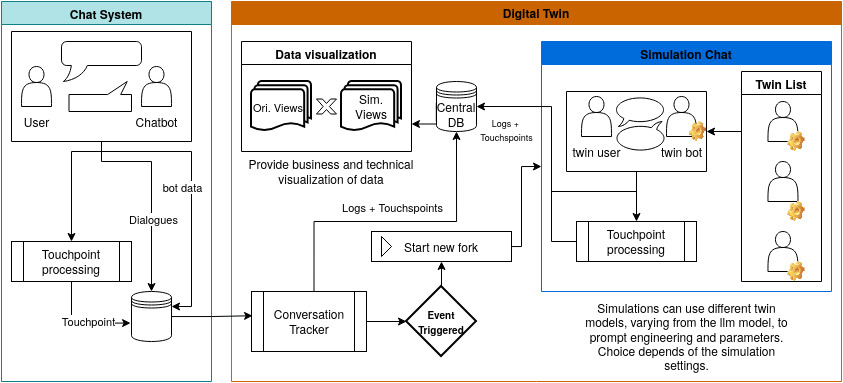

#  Monitoring of Conversation Agents with Digital Twin Systems _(dtchat)_

> Framework for building Digital Twins of conversational agents.

This project is part of a larger academic research for **Evaluation of Large Language Models**. The scope of this project is to create a framework or library that allows the creation of applications that monitors conversational agents using the Digital Twin architecture. To accomplish this, a simulated usecase is created to be monitored by the digital twin, this usecase is a chatbot for a imaginary bank, specialized in credit cards. Fake users also will be created to access the chatbot and simulate conversations. Finally, combining process minining techniques, the conversations will produce touchpoints (according to a predefined set, complying to business decision) that will be used to monitor and spin up digital twins for more complex testing and evaluation. 

A schematic of this research is provided below.




## Prerequisites
- Python +3.12
- An OpenAI API key
- [uv](https://docs.astral.sh/uv/) Package Manager

## Usage

1. Clone this repository:

```sh
git clone https://github.com/caio-bernardo/dt-chat.git
```

2. Set environment variables:

Clone/Create a `.env` file
```sh
cp .env.example .env
```

Fill with your keys and other parameters

3. Populate datasources for **RAG**.

Create a new folder called `RAG-Cartoes` and put your documents there.

```sh
mkdir RAG-Cartoes
```

> You can also change the target folder name in [scripts/embendder.py](scripts/embendder.py).

4. Create a Vector Store from the datasources.
```sh
chmod +x scripts/embendder.py
./scripts/embendder.py
```

You can also run using `uv`.

```sh
uv run --script scripts/embendder.py
```

To see what this script does and modify its behaivor see [scripts/embendder.py](scripts/embendder.py) or use `./scripts/embendder.py --help`.

> This process may take sometime, but only need to be done once.

5. Spin up _Banco Bot_ API Service.

```sh
uv run --package bancobot bancobot
```

To see how this works and modify its behaivor see [apps/bancobot](apps/bancobot/README.md).

6. Populate the databases with a swarm of users.
Run the following script:
```sh
chmod +x scripts/users_jam.py
./scripts/users_jam.py
```

To see what this script does and modify its behavior see [scripts/users_jam.py](scripts/users_jam.py) or use `./scripts/users_jam.py --help`.

## Project Structure

```sh
dt-chat/
├── data/
├── apps/
│   └── bancobot/
├── libs/
│   └── chatbot/
│   └── userbot/
├── scripts/
│   └── ...
```

### Applications _(apps)_

Contains packages to run necessary applications for the simulation.

**bancobot**: Banco Bot, a conversational agent specialized at assisting client from Bank X. See [apps/bancobot](apps/bancobot/README.md) for more.


### Libraries _(lib)_

Contains library code, it can be used by applications, scripts and outside packages.

**chatbot**: Abstraction over _Langchain_ agent creation. Allow for creating basic conversational agents and iteracting with them.

**userbot**: User Simulator, simulates a user to interact with a chatbot. Allows time-based simulations. See [libs/userbot](libs/userbot/README.md) for more.

### Scripts

Standalone python scripts to run some functionalities, like creating a vector store or reading a database. Each script contains its own set of dependencies and can be run without this project.

**embendder.py**: Create a vector store from knowlegde base documents.

**users_jam.py**: Generate a batch of simulated users against a conversational agent.

## License

This project is under the [MIT License](https://spdx.org/licenses/MIT.html). Check the [License](./LICENSE) for informations about permissions, distribution and modifications.
