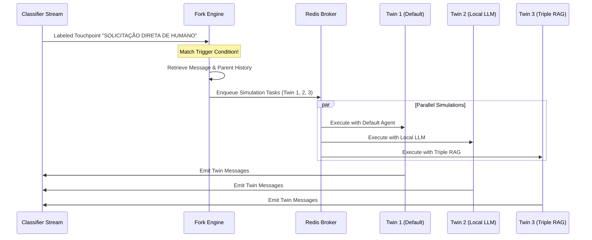

# Fork Engine

The `fork_engine` is the simulation core of the Digital Twin framework. It acts as a reactive testing engine that monitors events and duplicates conversation contexts at critical stages to compare alternative model configurations under identical starting conditions.

## Purpose

In typical agent testing, comparing different prompts, models, or RAG configurations requires restarting conversations from scratch, leading to high variability. The Fork Engine solves this by applying Digital Twin architecture: it watches the stream of classified touchpoints. When a critical "trigger" touchpoint is detected (the catalyst), it freezes the state, forks the conversation, and launches multiple parallel "what-if" simulations using different configurations of bots under identical conversational history.

## How It Works



1. **Event Listening**: The engine subscribes to the touchpoint event stream (`tp_channel`) on Redis.
2. **Condition Matching**: It monitors for defined trigger classes. By default, it looks for human messages classified as `"SOLICITAÇÃO DIRETA DE HUMANO"` (escalations, direct or complex requests).
3. **Context Harvesting**: On trigger detection, it retrieves the entire history of the active conversation from the database (the exact sequence of messages leading up to the catalyst).
4. **Digital Twin Spawning**: It forks the conversation into several simulation paths (cases) and initializes distinct conversational agents (e.g., local single-tool, local-triple, triple-rag, default single-rag) to take over the dialogue.
5. **Autonomic Simulation**: Parallel threads run UserBots (using the `userbot` library) loaded with the original user's persona configuration to interact with the forked chatbot setups, capturing exactly how each agent variant handles the situation from the exact same point in time.

> [!warning]
> Right now (prev 1.0.0) the only way of the forker working is by having a copy or using the same database as the produced messages and conversations. Remeber to provide access to them. (issue #26).

## Package Structure

```
apps/fork_engine/
├── src/
│   └── fork_engine/
│       ├── __init__.py
│       ├── config.py      # Logic to configure alternative agent layouts (twins)
│       ├── engine.py      # Core reactive engine class listening to the Redis stream
│       ├── helpers.py     # Database and parent context lookup helpers
│       ├── main.py        # Entry point configuring conditions & initializing run loop
│       ├── procedure.py   # Step-by-step task runner execution for a spawned twin
│       └── twinbots/      # Pre-configured chatbot agents used during forks
├── tests/                 # Unit tests for the engine components
├── pyproject.toml
└── README.md
```

## Running the Engine

Start the Fork Engine with `just`:

```sh
just forker
```

Under the hood, this runs:

```sh
uv run --package fork-engine fork-engine
```

For end-to-end details, see the [USAGE Guide](USAGE.md).
